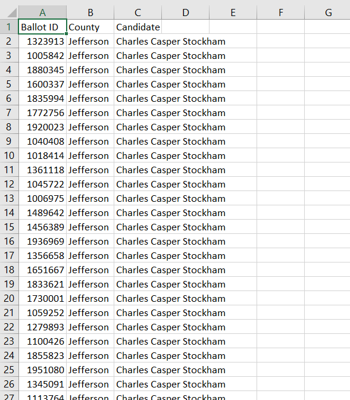

# Election_Analysis
## Overview of Election Audit
I helped Seth and Tom submit the election audit results to the election commission.
I need to write a python script to get
1. Total votes
2. Counties and how many votes each county have
3. The percentage of votes from each county out of the total count
4. The county with the highest turnout
5. Get a complete list of candidates who received votes
6. Calculate the percentage of votes each candidate won
7. Determine the winner of the election based on popular vote

## Resources
Data Source: election_results.csv

the dataset looks below:

## Election Audit Results
- How many votes were cast in this congressional election?
  - Total Votes: 369,711

- County vote
  - Jefferson:10.5% (38,855)
  - Denver:82.8% (306,055)
  - Arapahoe:6.7% (24,801)

- Which county had the largest number of votes?
  - Denver

- Provide a breakdown of the number of votes and the percentage of the total votes each candidate received.
  - Charles Casper Stockham: 23.0% (85,213)
  - Diana DeGette: 73.8% (272,892)
  - Raymon Anthony Doane: 3.1% (11,606)
- Which candidate won the election, what was their vote count, and what was their percentage of the total votes?
  - Winner: Diana DeGette
  - Winning Vote Count: 272,892
  - Winning Percentage: 73.8%

## Election Audit Summary
In the data, county column is the second column, so I use row[1] to get the county name. 
If the dataset column position changes, the code needs to be modified.
The better way is to write a script which can automatically identify each columns.
Furthermore, if dataset includes more columns such as 'State', I can modify the code by adding the similar method I used for county.
